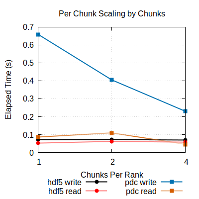
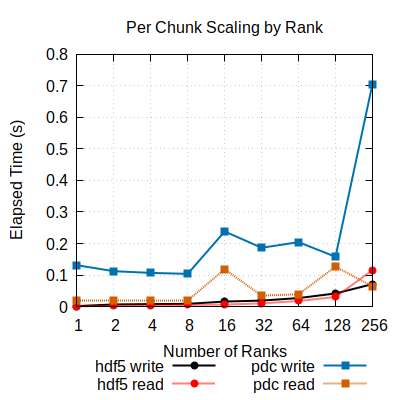
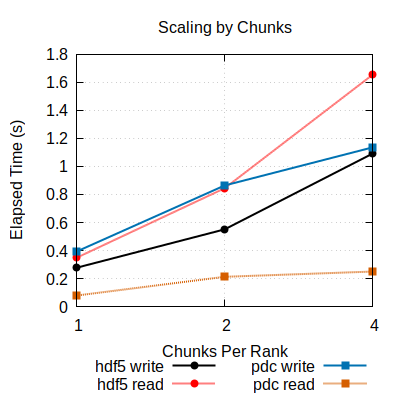
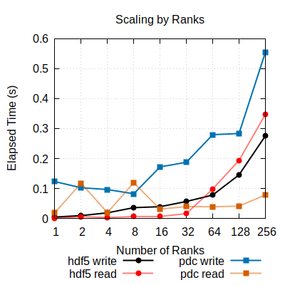
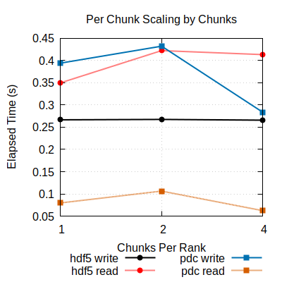

# HDF5 ZFP Baseline

This project provides a baseline implementation and benchmarking framework for evaluating the performance impact of the ZFP compression filter when applied to chunked HDF5 datasets. The benchmarks measure I/O scalability by varying chunk sizes and the number of MPI ranks, comparing throughput and latency with the ZFP filter enabled and disabled. This helps assess the trade-offs between compression efficiency and parallel I/O performance in HPC environments.

## Example Results (Just on Local Machine)

> **Note:** The current benchmark results shown below are from runs on Perlmutter. The region size used is 1 MB.

### ZFP Filter Enabled

<p align="center">
  
</p>
<p align="center"><em>Figure 1: All-chunk scaling performance by chunk size with ZFP filter enabled.</em></p>

<p align="center">
  
</p>
<p align="center"><em>Figure 2: All-chunk scaling performance by number of ranks with ZFP filter enabled.</em></p>

<p align="center">
  
</p>
<p align="center"><em>Figure 3: Per-chunk scaling performance by chunk size with ZFP filter enabled.</em></p>

<p align="center">
  
</p>
<p align="center"><em>Figure 4: Per-chunk scaling performance by number of ranks with ZFP filter enabled.</em></p>

---

### ZFP Filter Disabled

<p align="center">
  
</p>
<p align="center"><em>Figure 5: All-chunk scaling performance by chunk size without ZFP filter.</em></p>

<p align="center">
  
</p>
<p align="center"><em>Figure 6: All-chunk scaling performance by number of ranks without ZFP filter.</em></p>

<p align="center">
  
</p>
<p align="center"><em>Figure 7: Per-chunk scaling performance by chunk size without ZFP filter.</em></p>

<p align="center">
  
</p>
<p align="center"><em>Figure 8: Per-chunk scaling performance by number of ranks without ZFP filter.</em></p>


### Dependencies

1. cmake  
2. mpi
3. gawk
4. gnuplot

### First following variables in the env.sh file

Before running anything do `source env.sh`.

### Build ZFP

```bash
git clone https://github.com/LLNL/zfp.git

cmake .. \
  -DCMAKE_INSTALL_PREFIX=$ZFP_INSTALL_DIR \
  -DCMAKE_C_FLAGS="-DBIT_STREAM_WORD_TYPE=uint8" \
  -DCMAKE_CXX_FLAGS="-DBIT_STREAM_WORD_TYPE=uint8"
make -j$(nproc)
make install
```

### Build ZFP Filter

```bash
git clone https://github.com/LLNL/H5Z-ZFP.git

make HDF5_HOME=$HDF5_INSTALL_DIR \
     ZFP_HOME=$ZFP_FILTER_INSTALL_DIR \
     PREFIX=$ZFP_FILTER_INSTALL_DIR install
```

### Build HDF5

```bash
git clone https://github.com/HDFGroup/hdf5
git switch --detach hdf5-1.14.6

cmake -G "Unix Makefiles" \
  -DCMAKE_BUILD_TYPE=Release \
  -DBUILD_SHARED_LIBS=ON \
  -DBUILD_TESTING=ON \
  -DHDF5_BUILD_TOOLS=ON \
  -DHDF5_ENABLE_PARALLEL=ON \
  -DHDF5_ENABLE_SZIP_SUPPORT=OFF \
  -DCMAKE_INSTALL_PREFIX=$HDF5_INSTALL_DIR \
  ..

make -j$(nproc)
make install
```

### Compiling

First make sure `CMAKE_PREFIX_PATH` is set to HDF5 installation cmake directory and `CC` is set to an MPI compiler.

```bash
mkdir build
cd build
cmake ..
make -j$(nproc)
```
